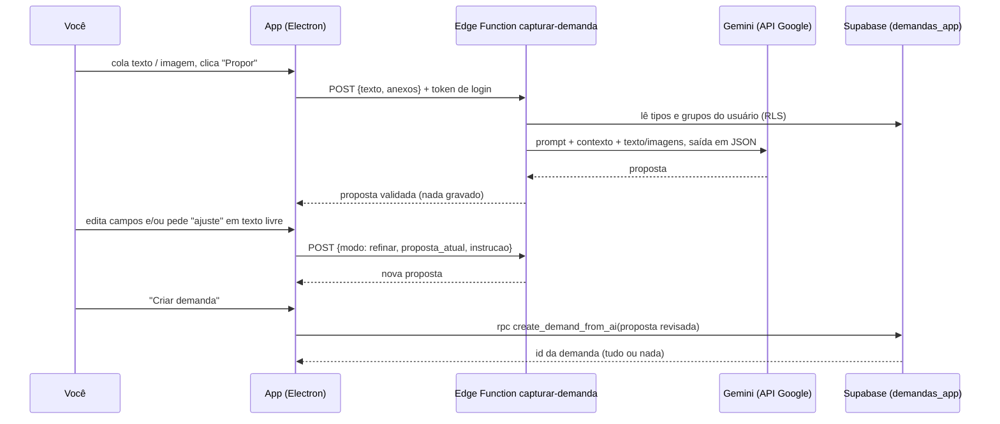

# Criar demandas com IA (captura)

Especificação da função "Nova demanda com IA" do Pauta. Você cola um texto (e-mail, mensagem, anotação) ou uma imagem (print, foto de documento, PDF), o Gemini (IA do Google) propõe a demanda com tipo, grupo, prazo, passo a passo em subtarefas e checklist e as dependências entre os passos. Você revisa, edita ou pede ajustes em linguagem natural, e só quando confirma a demanda é criada.

Arquivos no repositório:

| Arquivo | O que é |
|---|---|
| `docs/ia/README.md` | Esta especificação |
| `docs/ia/prompt-sistema.md` | O prompt de sistema, comentado |
| `docs/ia/proposta.schema.json` | Formato exato da proposta que a IA devolve |
| `supabase/functions/capturar-demanda/index.ts` | Edge Function (Deno/TypeScript) que chama o Gemini |
| `supabase/functions/capturar-demanda/prompt.ts` | Prompt e schema no formato que o código importa (gerado dos dois arquivos de `docs/ia`) |
| `backend/migrations/20260930000005_create_demand_from_ai.sql` | RPC que grava a proposta revisada numa transação |
| `backend/migrations/20260930000006_ai_settings.sql` | Chave do Gemini salva pelo app, criptografada no Supabase Vault |

## 1. Fluxo



Dois pontos de desenho:

- **A IA nunca grava.** A Edge Function só devolve a proposta. Quem grava é o app, com o login do usuário, pela RPC. Assim nada é criado sem revisão, e o RLS e as regras do banco (dependências, ciclos, dono) valem igual a uma criação manual.
- **Gravação em uma transação só.** Demanda, subtarefas, checklists e dependências entram juntos. Se algo falhar (um ciclo, por exemplo), nada fica pela metade.

## 2. Onde fica a chave da API

Você cola a chave do Gemini no próprio app, em **Configurações > Inteligência artificial**, e clica em Salvar. Ela vai para o Supabase e fica **criptografada no Supabase Vault** (a extensão já está instalada no central-gerencial-prod). Nunca fica gravada no computador nem dentro do instalador do app.

Como funciona (`backend/migrations/20260930000006_ai_settings.sql`):

- O app chama `rpc('set_ai_key', { p_key, p_model })`. A função guarda a chave no Vault e registra em `demandas_app.ai_settings` só o final dela (`key_hint`, ex.: "…a1B2"), o modelo escolhido e a data.
- O app **só escreve** a chave. Ele não consegue ler de volta: a tabela mostra apenas `key_hint`, `model` e `updated_at`, e a leitura do Vault é bloqueada para o usuário. Para trocar, cola outra; para remover, `rpc('clear_ai_key')`.
- A Edge Function lê a chave do usuário logado pela função `get_ai_key`, que só a service role pode executar.
- Cada usuário tem a própria chave (RLS). Se um dia o app tiver mais pessoas, cada uma usa a sua cota gratuita.
- Plano B: se nenhuma chave foi salva pelo app, a função usa o segredo `GEMINI_API_KEY` da Edge Function, caso exista.

Onde pegar a chave: aistudio.google.com, menu **Get API key**.

Publicar a função: `supabase functions deploy capturar-demanda --project-ref xwdvbzexezsnwvattgnv` (com a pasta `supabase/functions/capturar-demanda` dentro do projeto do app). A função exige login (verificação de JWT padrão do Supabase ligada). Tipos e grupos são lidos com o token do próprio usuário; a service role só é usada para ler a chave.

### Tela Configurações > Inteligência artificial (para o design)

- Campo **Chave do Gemini** (tipo senha, com olho para mostrar o que está sendo digitado) e link "Onde pego a chave?" abrindo aistudio.google.com.
- Campo **Modelo** como lista de seleção, preenchida com `{ modo: "modelos" }` depois que a chave é salva (só modelos Gemini que geram texto, mais novos primeiro). Antes de haver chave, a lista fica desabilitada com o padrão.
- Botão **Salvar e testar**: chama `set_ai_key` e depois a função com `{ modo: "testar" }`. Mostra "Chave funcionando (gemini-3.8-flash)" em verde ou a mensagem de erro devolvida.
- Com chave salva, o campo aparece vazio e acima dele o estado: "Chave salva: …a1B2, atualizada em 30/09". Botões **Trocar chave** e **Remover chave**.
- Aviso fixo em texto pequeno: "No plano gratuito, o Google pode usar o que você envia para melhorar os produtos dele. Não envie documentos sigilosos."
- Sem chave salva, o botão "Nova com IA" continua visível; ao clicar, abre esta tela com a mensagem "Configure a chave do Gemini para usar a IA".

## 3. Chamada à API

| Parâmetro | Valor | Por quê |
|---|---|---|
| Endpoint | `POST https://generativelanguage.googleapis.com/v1beta/models/{modelo}:generateContent`, chave no cabeçalho `x-goog-api-key` | Uma chamada REST com `fetch`, sem SDK nem ferramentas |
| Modelo | o escolhido em Configurações (normalizado: "Gemini 2.5 Flash" vira `gemini-2.5-flash`); senão o segredo `GEMINI_MODEL`; senão `gemini-3.8-flash` | Tem nível gratuito, lê imagem e PDF e aceita saída em JSON |
| Chave | a do usuário (Vault) ou o segredo `GEMINI_API_KEY` | Ver seção 2 |
| `generationConfig` | `responseMimeType: application/json` e `responseJsonSchema` = `{ propostas: [proposta.schema.json] }` | A resposta vem no formato da proposta. Se o modelo recusar o schema, a função repete o pedido só com JSON e o schema no texto |
| `maxOutputTokens` | 16000 | Folga; uma proposta usa bem menos |
| `systemInstruction` | `prompt-sistema.md` | Fixo; data, tipos e grupos vão na mensagem |
| `contents` | contexto (hoje, dia da semana, tipos, grupos) → imagens/PDF em `inlineData` → texto dentro de `<origem>` | Imagens antes do texto; `<origem>` separa o material recebido das instruções |

Tratamento da resposta (em `index.ts`):

- Bloqueio de conteúdo (`promptFeedback.blockReason`, `finishReason` `SAFETY` ou `PROHIBITED_CONTENT`): 422 "A IA não processou esse conteúdo. Crie a demanda manualmente."
- `finishReason = "MAX_TOKENS"`: 422 pedindo um trecho menor.
- Sem chave nenhuma: 412 "Configure a chave do Gemini em Configurações > Inteligência artificial."
- Sobrecarga (503/500) ou limite (429): a função repete no mesmo modelo após 1,5 s e 4 s; se continuar, tenta os modelos reserva (`gemini-2.5-flash`, `gemini-2.5-flash-lite`, ou o segredo `GEMINI_MODELOS_RESERVA`). Um modelo inexistente (404) também passa para a reserva. `uso.modelo` diz qual modelo respondeu. Se todos falharem, devolve a mensagem do modelo escolhido (429 para limite, 502 para sobrecarga).
- 400/401/403 (chave errada ou pedido inválido): não troca de modelo; 502 com o detalhe nos logs da função. Outros erros: 502.
- Partes marcadas como `thought` (raciocínio) são descartadas; a proposta é o texto restante.
- A função `validar()` aplica o que o JSON schema não expressa: até 8 subtarefas, 12 itens por checklist, 3 perguntas; datas e horas válidas (sem data não há hora); estimativa positiva; `ref` únicos; remove dependências para `ref` inexistente e quebra ciclos (o banco recusaria).
- Depois resolve `type_name` e `group_path` para `type_id` e `group_id` comparando com os existentes sem diferenciar maiúsculas. Se não achar, o id vem `null` e o app mostra o nome como "novo".

**Custo:** zero no nível gratuito do Gemini, que tem limite de chamadas por minuto e por dia. Para uso pessoal, algumas dezenas de capturas por dia, deve bastar; se o limite estourar, a tela mostra o aviso e você tenta de novo depois. A resposta traz `uso` com os tokens de cada chamada.

**Tempo:** estimativa de 5 a 30 segundos por proposta. O app mostra "Lendo o material…" com opção de cancelar.

**Testado sem chave:** a função rodou com Supabase e Gemini simulados (pedido montado no formato da documentação atual, validação, ciclos, erros 429 e bloqueio, chave lida do Vault, modo testar e plano B pelo segredo). A primeira chamada real, depois de salvar a chave, é o que confirma a integração de ponta a ponta.

## 4. Formato da proposta

Definido em `proposta.schema.json`. Os nomes de campo são os das colunas de `demandas_app`, para o app mandar a proposta revisada para a RPC quase sem conversão.

```json
{
  "summary": "Recurso do processo 123 a protocolar até 15/10, pedido pelo cliente X.",
  "demand": {
    "title": "Protocolar recurso do processo 123",
    "description": "Pedido de Fulano (cliente X) por e-mail em 30/09.",
    "type_name": "Processo", "type_id": "…uuid ou null se novo…",
    "group_path": "Trabalho / Cliente X", "group_id": "…",
    "priority": 3, "due_date": "2026-10-15", "due_time": "17:00",
    "estimated_minutes": null,
    "external_ref": "0001234-56.2026.8.26.0100",
    "checklist": ["Conferir prazo no sistema", "Avisar o cliente do protocolo"]
  },
  "subtasks": [
    {"ref": "s1", "title": "Redigir recurso", "description": null, "due_date": null, "due_time": null,
     "estimated_minutes": 120, "checklist": ["Revisar jurisprudência"], "depends_on": []},
    {"ref": "s2", "title": "Colher assinatura do cliente", "description": null, "due_date": "2026-10-14",
     "due_time": null, "estimated_minutes": 15, "checklist": [], "depends_on": ["s1"]},
    {"ref": "s3", "title": "Protocolar no sistema", "description": null, "due_date": null, "due_time": null,
     "estimated_minutes": 20, "checklist": [], "depends_on": ["s2"]}
  ],
  "questions": ["O prazo de 15/10 é a data final do tribunal ou a sua data interna?"]
}
```

Como cada parte vira dado:

| Proposta | Tabela | Observação |
|---|---|---|
| `demand` | `demands` (sem `parent_id`) | `status` = `todo` |
| `demand.checklist[]` | `checklist_items` da demanda | `position` = ordem |
| `subtasks[]` | `demands` com `parent_id` = demanda principal | Herdam grupo, tipo e prioridade. A principal só conclui quando todas concluírem (regra que já existe) |
| `subtasks[].checklist[]` | `checklist_items` da subtarefa | |
| `subtasks[].depends_on[]` | `demand_dependencies` | "s3 só conclui depois de s2" |
| `type_name` sem id | `demand_types` novo | Reaproveita se já existir com o mesmo nome |
| `group_path` sem id | `groups` novo na raiz | Idem |
| `summary` e `questions` | não gravados | Só para a revisão. O app pode gravar uma linha em `demand_updates` via `note` ("Criada com IA a partir de e-mail") |

Regra que o prompt usa para dividir os passos: vira **subtarefa** o passo com mais de ~30 minutos, prazo próprio, dependência de terceiros, ou do qual outro passo depende (subtarefa tem cronômetro e pomodoro próprios). Vira **checklist** o passo rápido feito na mesma sentada. Dependência só quando um passo realmente precisa do resultado do outro, não pela simples ordem.

## 5. Pedido da Edge Function

`POST /functions/v1/capturar-demanda` (no app: `supabase.functions.invoke("capturar-demanda", { body })`).

```ts
// criar
{ modo: "criar", texto?: string, anexos?: { media_type: "image/png" | "image/jpeg" | "image/webp" | "image/gif" | "application/pdf", data: string /* base64 */ }[] }
// ajustar
{ modo: "refinar", proposta_atual: Proposta, instrucao: "junte as duas primeiras subtarefas e tire o prazo", texto?: string }
// testar a chave salva (consulta o modelo no Google, não gera nada)
{ modo: "testar" }  // resposta: { ok: true, modelo, origem: "app" | "servidor" } ou { ok: false, erro }
// modelos que a chave pode usar, para a lista de seleção em Configurações
{ modo: "modelos" } // resposta: { ok: true, modelos: [{ id: "gemini-2.5-flash", nome: "Gemini 2.5 Flash" }], atual } ou { ok: false, erro }
```

Resposta: `{ proposta, propostas, uso: { modelo, input_tokens, output_tokens } }` ou `{ erro }` com status 4xx/5xx. `propostas` é a lista (quase sempre com uma; até 5 só quando a pessoa pede explicitamente mais de uma demanda; no modo refinar, sempre uma). `proposta` é a primeira, para apps que ainda tratam uma só. O app grava cada proposta aprovada com uma chamada à RPC.

Limites: texto até 60 mil caracteres; até 5 anexos de até 5 MB. **O app reduz as imagens antes de enviar** (lado maior com até 1568 px, JPEG qualidade ~85): fica mais rápido e mais barato sem perder leitura. No modo refinar o app não reenvia as imagens: a proposta atual já carrega o que foi lido delas.

## 6. Tela de revisão (para o design)

Entrada:
- Botão "Nova com IA" ao lado de "Nova demanda", e atalho (sugestão: Ctrl+Shift+N).
- Caixa grande que aceita colar texto, colar imagem (Ctrl+V de um print), arrastar arquivo (imagem ou PDF) ou escolher arquivo. Miniaturas dos anexos com "remover".
- Botão "Propor".

Revisão (mesma janela, depois do "Propor"):
- No topo, o `summary` ("Entendi assim: …") e as `questions` como avisos amarelos.
- Formulário igual ao da demanda, já preenchido: título, tipo, grupo, prazo (data + hora), prioridade, estimativa, referência externa, descrição. Tipo ou grupo sem id aparecem com a etiqueta "novo" e podem ser trocados por um existente.
- Checklist editável (adicionar, remover, reordenar).
- Lista de subtarefas, cada uma expansível com seus campos e checklist; campo "Depende de" com as outras subtarefas; setas para reordenar; botão para transformar subtarefa em item de checklist e vice-versa.
- Caixa "Pedir ajuste à IA" (ex.: "divida a redação em pesquisa e escrita") com botão "Ajustar". A proposta volta com as edições manuais preservadas.
- Rodapé: "Descartar" e "Criar demanda". Criar chama a RPC e abre o detalhe da demanda criada.

Estados: carregando ("Lendo o material…", com cancelar), erro (mensagem da função e botão "Criar manualmente com o que já foi preenchido").

## 7. Gravação: RPC `demandas_app.create_demand_from_ai(p jsonb)`

Em `backend/migrations/20260930000005_create_demand_from_ai.sql`. Recebe a proposta revisada (mesmo formato da seção 4, aceitando `type_id` ou `type_name`, `group_id` ou `group_path`, e `note` opcional) e devolve o id da demanda principal. `security invoker`: roda como o usuário, então RLS e triggers valem. O teste cobre: reaproveitar tipo pelo nome, criar grupo e tipo novos sem duplicar, ignorar item de checklist vazio, subtarefas herdando grupo e prioridade, dependências gravadas e respeitadas na conclusão, ciclo desfazendo tudo, `ref` inexistente, título vazio e grupo de outro usuário recusado.

Testes: `backend/tests/` (ver `backend/tests/run.sh`).

## 8. Segurança e privacidade

- **No nível gratuito, o Google pode usar o que for enviado para melhorar os produtos dele**, e isso pode incluir revisão humana (é a regra da página de preços do Gemini; no nível pago isso não acontece). Na prática: não capture documentos com dados sigilosos de clientes, processos em segredo de justiça ou dados pessoais de terceiros enquanto estiver no gratuito. Se precisar, ative o faturamento na mesma chave e o uso passa a não ser aproveitado pelo Google.
- O prompt trata o material colado como conteúdo, não como ordem, e a IA não tem ferramentas nem acesso ao banco: um e-mail malicioso no máximo gera uma proposta estranha, que você vê antes de criar.
- A Edge Function não guarda o material nem a proposta. Os logs só registram erros da API.

## 9. Depende de outras frentes

| Frente | O que precisa | Estado |
|---|---|---|
| Backend Supabase | RPC `create_demand_from_ai` e tabela/funções da chave (migrations 05 e 06) | Aplicadas no central-gerencial-prod |
| Edge Function | Publicar `capturar-demanda` no central-gerencial-prod (`supabase functions deploy capturar-demanda`) | Pendente |
| Design das telas | Botão "Nova com IA", captura e revisão (seção 6); Configurações > Inteligência artificial (seção 2) | Enviado ao design |
| App | Reduzir imagens, chamar a função, montar a revisão, chamar a RPC | A fazer |
| Backend Supabase (opcional) | Tabela `ai_usage` (owner, data, tokens, modelo) para acompanhar uso | Sugestão, não bloqueia |

## 10. Próximos passos possíveis

- **Conflito com reuniões (fase Outlook):** na revisão, avisar se o prazo proposto cai em cima de uma reunião e sugerir outro horário. Depende da tabela de eventos externos (divergência D4).
- **Ligar a demandas existentes:** mandar os títulos das demandas abertas para a IA sugerir "depende da demanda X". Aumenta custo e exposição de dados, por isso ficou fora da primeira versão.
- **Sugerir rotina:** se o material descreve algo recorrente ("todo dia 5 enviar…"), propor uma rotina em vez de uma demanda.
- **Captura rápida:** atalho global que tira print de uma área da tela e já abre a captura.
